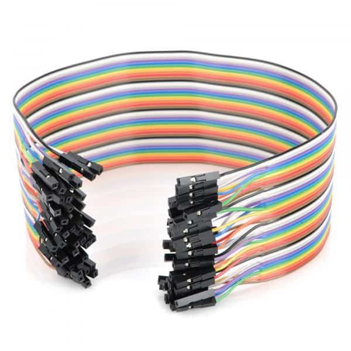

# eGreenBin

> **Every year, Vietnam in particular and the world in general spend hundreds of billions of dollars on garbage classification**
> 

**eGreenBin** is an open source solution born to solve the problem of garbage sorting by helping to build and form habits and awareness for children from an early age.

Our goal is provide solution for those 3 major pillar recommended by WHO.
<div align="center">
  
  
  
</div>


## Solution in action

We submit our solution in GDSC solution challenge 2023 base on 17 Sustainable Development Goals of the United Nations,

Youtobe: https://www.youtube.com/watch?v=zjyDpbqOUus

### **eGreenBin smart bin**

<div align="center">
    
</div>
<div align="center">
    
</div>
<div align="center">
    
</div>


### **eGreenBin for teacher**

<div align="center">
    
</div>


### eGreenBin-devices

**Installation**

- IDE: PlatformIO / Arduino IDE:
    
    
<div align="center">
    
</div>
    
    - Libraries:
        
      
<div align="center">
    
</div>
        
        ⇒ ESP8266WiFi
        
        ArduinoJson
        
        WebSocketServer
        
        ESP8266WebServer
        
        AccelStepper 
        
    - Prepare for build system:
        - Master: ESP8266.
        - Slave: Arduino Uno R3 + CNC Shield V3 + Driver A8825 + Stepper Motor .
        - Sensor: HC-SR04 (Ultrasonic Sensor).
1. Hardware Part
    - ESP8266:
        - Link: [ESP8266 Wi-Fi MCU I Espressif Systems](https://www.espressif.com/en/products/socs/esp8266)
        
        
<div align="center">
    
</div>
        
    - HC-SR04 (Ultrasonic Sensor)
        - Link: [Ultrasonic Distance Sensor - HC-SR04 - SEN-15569 - SparkFun Electronics](https://www.sparkfun.com/products/15569)
        
        
<div align="center">
    
</div>
        
    - LCD 16x2 I2C:
        - Link: [LCD 1602 kèm module I2C màu xanh lá - Nshop (nshopvn.com)](https://nshopvn.com/product/lcd-1602-kem-module-i2c-mau-xanh-la/)
        
<div align="center">
    
</div>
        
    - Driver A8825:
        - Link: [Mạch Điều Khiển Động Cơ Bước DRV8825 - Nshop (nshopvn.com)](https://nshopvn.com/product/mach-dieu-khien-dong-co-buoc-drv8825/)
        
 <div align="center">
    
</div>
        
    - Stepper Motor:
        - [Động cơ bước size 42 1.8 step - Nshop (nshopvn.com)](https://nshopvn.com/product/dong-co-buoc-size-42-1-8-step/)
        
<div align="center">
    
</div>
        
    - Power: 12V - 3A (Using **220V power directly or backup charger).**
    - Others:
        - BreadBoard:
            
<div align="center">
    
</div>
            
        - Wire:
            
<div align="center">
    
</div>
            
    - Materias
        - Formex
        - Mica
    
    ⇒ For ease of control, I have added the CNC Shield V3 circuit to it:
    
<div align="center">
    
</div>
    
2. **Wired diagram**
    
<div align="center">
    
</div>
    
    - **Explanation:**
        - We are using a 12V - 3A power supply directly from the 220V input to run the stepper motor by connecting with CNC Shield V3.
        - We are using a power source from a portable charger to supply power to both circuits:
            - Master: ESP8266.
            - Slave: Arduino Uno R3.
        - In reality, we use the CNC Shield V3 board to operate the stepper motor, but for simplicity, we have replaced it with a different board in a 3D model form to make it easier for everyone to understand how our system is deployed.
    - **Functions of devices:**
        - ESP8266: Connecting to a Wifi network and becoming a data transmission center.
        - LCD 16X2 I2C: Displaying the IP address of the network used by ESP8266 to input for two phones connecting to the IoT system.
        - HC-SR04: Detecting when trash is thrown in.
        - Arduino Uno R3 + CNC Shield V3 + Driver A8825: Controlling the operation of a stepper motor.
3. **IoT division**
    - Reasons for choosing a specific circuit board:
        - Device that is easy to find, affordable, and suitable for students.
            - Arduino Uno: The Arduino Uno is a popular microcontroller board that is easy to find and affordable, and is commonly used in electronics projects and prototyping. It has a wide range of input/output pins, and can be programmed using the Arduino IDE.
            - ESP8266 WiFi module: The ESP8266 WiFi module is a low-cost WiFi module that can be used to add WiFi connectivity to electronics projects. It has a built-in microcontroller and can be programmed using the Arduino IDE, making it a versatile and affordable option for students.
    - Web socket protocol - Useful when using ESP8266 because it provides several benefits over traditional HTTP-based communication:
        - WebSocket provides a full-duplex communication channel over a single TCP connection. This means that the client and server can send messages to each other simultaneously without having to wait for a response. This real-time capability is especially important for IoT applications that require immediate responses.
        - WebSocket has lower overhead compared to HTTP because it uses a smaller message format and does not require the client to resend headers with every request. This makes WebSocket more efficient for data transfer, especially when dealing with large amounts of data.
        - WebSocket is easier to implement than other real-time communication protocols such as UDP and MQTT. It uses a simple and straightforward API, making it easier to integrate into your application.
    - Communicating ESP8266 with Arduino Uno R3 by using SDA and SCL pin - Using the I2C (Inter-Integrated Circuit) protocol:
        - The I2C protocol is a widely used communication protocol for communicating between microcontrollers and other devices such as sensors and displays.
    - How to set up project:
        - **Step 1**: Connecting ESP8266 to any WiFi network by input SSID and PASSWORD here!
            
            ```cpp
            const char* ssid = "<YOUR_SSID>";
            const char* password = "<YOUR_PASSWORD>";
            ```
            
        - **Step 2:**  After connecting to a WiFi network, the LCD screen will display the IP address information. We enter this IP address into the 2 devices we want to connect. When you see "2 devices connected" on the screen, it means that our system has completed the setup.
        - **Step 3**: Let's get started with your project.
        

## Use case diagram


<div align="center">
    
</div>

## User flow

<div align="center">
    
</div>


---


<div align="center">
    
</div>

We also encourage everyone who is interested in the eGreenBin project to contribute to make eGreenBin better in the future.

**Project structure module:**

1. Mobile for garbage classification: https://github.com/GDSC-UIT/eGreenBinWasteClassification.git
2. Mobile for face detect, recognition and interact: https://github.com/GDSC-UIT/eGreenBinInteract.git
3. Mobile for teacher: https://github.com/GDSC-UIT/eGreenBin-mobile.git
4. Backend Golang: https://github.com/GDSC-UIT/eGreenBin-backend-api.git
5. Backend FastAPI to host AI: https://github.com/GDSC-UIT/eGreenBinFace_Recognition_api.git
6. IOT Embedded device: https://github.com/GDSC-UIT/eGreenBinIOT.git
